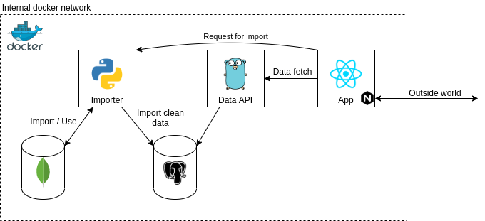

# Requirements
- Python3
- Docker
- Docker-compose

# Architecture


Every member of this archtecture has own container built by `Docker`. All of the containers are running in the same network by using `docker-compose` app. 

Apps are accessible on localhost, especially.
- Importer - `localhost:4200`
- Data API - `localhost:8080`
- App - `localhost:80`

All REST API are communicating only in JSON format.
(Postgres and mongo are reachable only for apps inside)

## Importer
Importer is AIOHTTP REST API, which fetches the data from data sources. It listens on:
- `HTTP GET - /covid19/fetch` - Fetches the COVID19 data to mongodb, cleans it, formats it and inserts only important data to postgres

- `HTTP GET - /deaths/fetch` - Fetches the Deaths data to mongodb, cleans it, formats it and inserts only important data to postgres

Both endpoints have avaiable HTTP parameters in query:
- `wipe=true` - Wipes both databases and inserts data
- `mongo=true` - Inserts data only to mongo
- `sql=true` - Inserts data only to sql

For fetching and automation purposes there are two scripts avaiable for fetching
- `import-covid.sh`
- `import-deaths.sh`

Scripts just contacts mentioned endpoints and also accepts all HTTP parameters and sends them.

## Data API
Data API is an Golang GIN REST API, which responds on the given queries from the project. It listens on:
- `HTTP GET - /query/ratio` - Answers the ratio project query
- `HTTP GET - /query/infected` - Answers the infected project query

### Ratio endpoint
This endpoint can accept two HTTP query parameters.
- `date_from=<date>`
- `date_to=<date>`

Given intervals signifies the range of the data that user wants to request.

### Infected endpoint
This endpoint cann accept HTTP query parameters.

For interval of COVID infected growth.
- `growth_from=<date>`
- `growth_to=<date>`

For interval of COVID SMA and it's step.
- `sma_from=<date>`
- `sma_to=<date>`
- `sma_step=<date>`

## App
App is the main point-of-interest for user, it is a React web application visualising the queries in graphs. None of the mentioned endpoints need to be reached "manually", all of this is done from App and should usually be.

# Starting project
In the root of the folder run.
```
docker-compose up --build
```
This will rebuild the files and containers, which takes too long. Use
this only when you want to test or run production the whole app and don't want to develop on the app. The apps has setup entrypoints and will start by itself. This will take a few minutes.

For next usage after the build is done use just.
```
docker-compose up
```


The problem is when you change the source code, you need to rebuild it which takes too long, for this is dedicated the next section `Developing`.

# Developing
For developing there is a script called ```run-dev.sh``` which merges the two docker compose files (devel and docker-compose). The script just passes the other arguments to docker-compose app.

So you can start your instance for developing.
```
./run-dev.sh up
```

This will start containers, psql and mongo, and other containers will remain to sleep infinity. Api and importer will remain sleep infinity and have the source code live mounted into the container so you dont need to rebuild it every time when you change the code, like in first example.

Now you need to get into the shell of the two containers
```
docker exec -it upa-api bash
```
```
docker exec -it upa-importer bash
```

Now in two terminals you are in the shell of the containers, you can start the python and golang app.
```
bash entrypoint.sh
```
```
go run upa/api
```

Now you can change the source code and just restart the apps (not rebuilding the containers).
